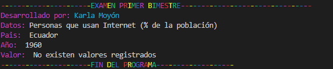
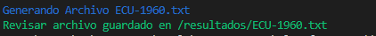
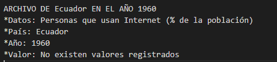

## Plataformas Web P56 - Examen Primer Parcial 

Aplicación en NodeJS que permite leer los datos de porcentajes de personas que usan Internet dependiendo
del año y país que desee el usuario. Por defecto, se consultará del año 1960 y con código de Ecuador "ECU"

## Comenzando 🚀

_Estas instrucciones te permitirán obtener una copia del proyecto en funcionamiento en tu máquina local para propósitos de desarrollo y pruebas._

### Pre-requisitos 📋

 * **Git** .- https://git-scm.com<br/><br/>
 * **Node.js** .- https://nodejs.org. Tenga en cuenta que la versión debe ser igual o superior a la versión 8.<br/><br/>
 * **Npm** .- Administrador de paquetes Node.js, viene con Node.js. Asegúrese de que la versión npm sea igual o superior a la versión 5.
<br/>

### Instalación 🔧

_Cuando haya completado la configuración de herramientas, debe descargar el código de la aplicación. La forma más fácil de hacerlo es clonar el repositorio de GitHub:_

```
git clone https://github.com/karlaVane/examenVII.git
```

_Una vez completado la clonación, se debe instalar los módulos npm_

```
npm install --save
```

## Ejecutando las pruebas ⚙️

Para ejecutar y visualizar los resultados en consola y página web, se deberá ingresar los parámetros según el comando:
```
node app publicar -f="NombreDirectorio" -c="CódigoPaís" -y="Año desde 1960 hasta 2018"
```
```
node app guardar -f="NombreDirectorio" -c="CódigoPaís" -y="Año desde 1960 hasta 2018" -o="NombreNuevoArchivo"
```
Por defecto:
-y= 1960
-c="ECU"

1. **Nombre de directorio.-** Se deberá ingresar la ruta donde se encuentra ubicado el archivo de la data descargada.

```
"/home/Downloads/datos.csv" 
```

2. **Codigo del Pais.-** País a analizar a través de su código [ISO 3166 ALPHA-3](https://laendercode.net/es/3-letter-list.html).

```
"ECU" 
```
3. **Año.-** Desde 1960 hasta 2019, por defecto año 1960
```
1997 
```


**Ejemplos:**
```
node app.js mostrar-f="datos.csv"
```
```
node app.js guardar -f="datos.csv" 
```


<br>

### **Ejecución:**
* **Comando mostrar:**
**Ejecución en consola:**
<center><br></center>


* **Comando guardar:**
**Ejecución en consola:**
<center><br></center>

**Archivo txt guardado:**
<center><br></center>


### Comandos:
* **mostrar:** Tiene por parametros obligatorios a:
   * _archivo  -f_ : En este comando se ingresa el directorio o path donde esta ubicado los datos de las suscripciones moviles por pais.
   * _pais -c_: En este comando se ingresa el codigo de del pais.
   * _anio -y_: Permite especificar el año para el cual se requiere las estadísticas.

<br>
* **guardar:** Tiene por parametros obligatorios a:
   * _archivo -f_: En este comando se ingresa el directorio o path donde esta ubicado los datos de las suscripciones moviles por pais.
   * _pais -c_: En este comando se ingresa el codigo de del pais .
   * _anio -y_: En este comando permite especificar el año para el cual se requiere las estadísticas.

## Construido con 🛠️

_Las herramientas utilizadas en el proyecto:_
* [Visual Studio code](https://code.visualstudio.com/) - Editor de código fuente
**Librerías** 
* [colors](https://www.npmjs.com/package/colors) - colores a la ejecucion de la terminal
* [yargs](https://www.npmjs.com/package/yargs) - Yargs te ayuda a crear herramientas interactivas de línea de comandos, analizando argumentos y generando una elegante interfaz de usuario.
* [neat-csv](https://www.npmjs.com/package/neat-csv) - Analizador CSV rápido

## Autores ✒️
* **Moyón Karla** - [karlaVanel](https://github.com/karlaVane/)
